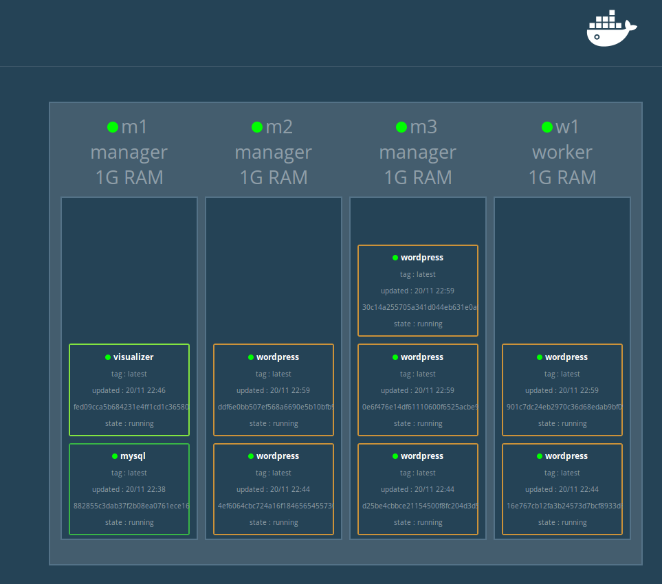

# Automation of Docker 1.12 Swarm-Mode workshop :whale:

## Description

Simple scripts using docker-machine and swarm-mode of Docker 1.12 to automate the creation of a swarm cluster
and the deployment of a wordpress stack on it.
The wordpress stack is composed of a wordpress service (with N replicas) and a mysql service (with only one replica).
A [Docker Swarm Visualizer](https://github.com/ManoMarks/docker-swarm-visualizer) service is also deployed to have a graphical view of the cluster. 

## Prerequisites

Before you start, make sure you have :

* [Docker 1.12+](https://docs.docker.com/engine/installation/) installed,
* [Docker Machine 0.8.2+](https://docs.docker.com/machine/install-machine/) installed

 ## How to use

### Configure a cluster

Edit the `env_cluster.sh` file to configure the cluster :
     
### Create a cluster

```
./create-cluster.sh
```

The wordpress app will be accessible at : http://\<ANY_SWARM_NODE_IP\>:${WORDPRESS_SERVICE_PUBLISHED_PORT}

The swarm vizualiser will be accessible at : http://\<ANY_SWARM_NODE_IP\>:${VISUALIZER_PORT} and will display a dynamic view of the swarm :



### Play with the cluster

* Scale the wordpress service to 10 replicas
```
docker service update --replicas=10 wordpress
```

* Stop one of the containers of wordpress service and check that swarm-mode starts another replicas to maintain the descriptive state.

* Delete a manager node and check that swarm-mode elects a new leader and that services containers that were on this node are started on another node. 

* and many others things to test !

### Delete cluster

```
./delete-cluster.sh
```

